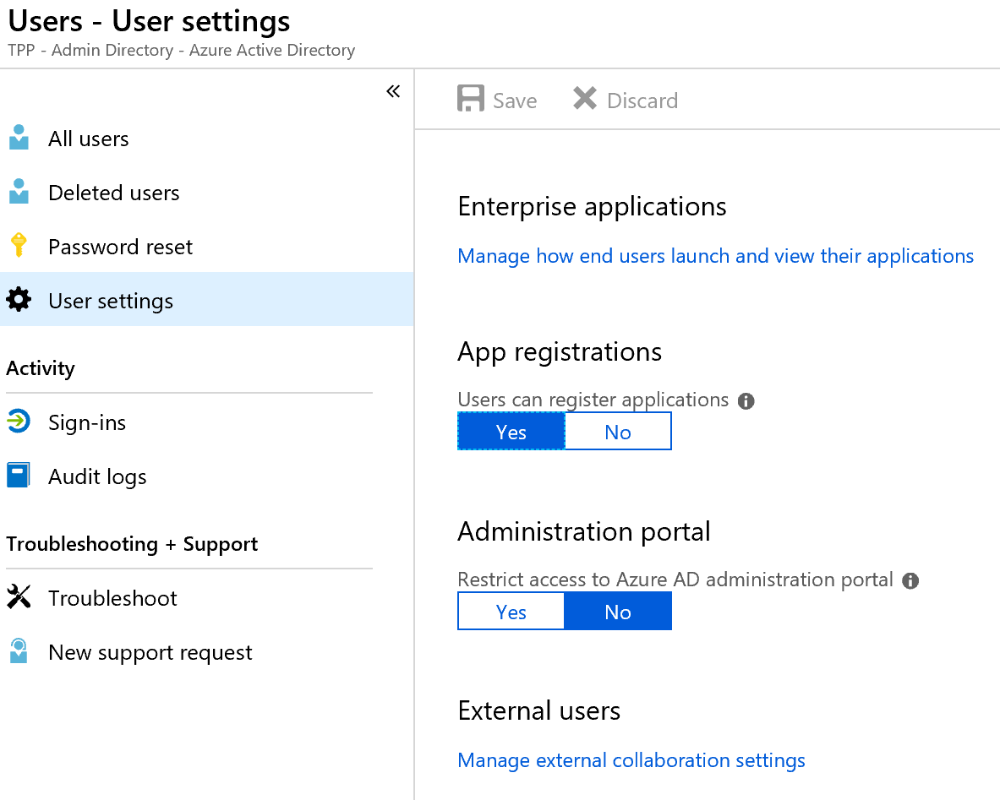
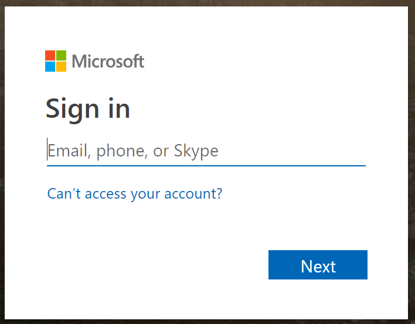
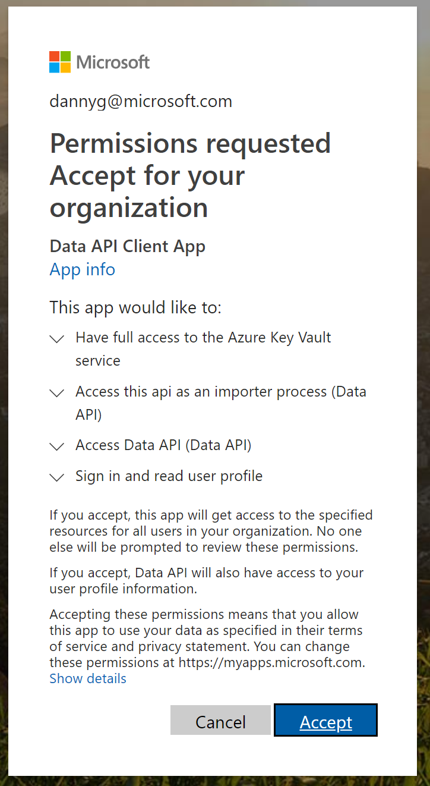
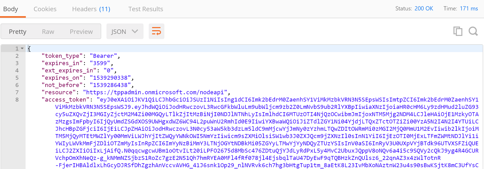
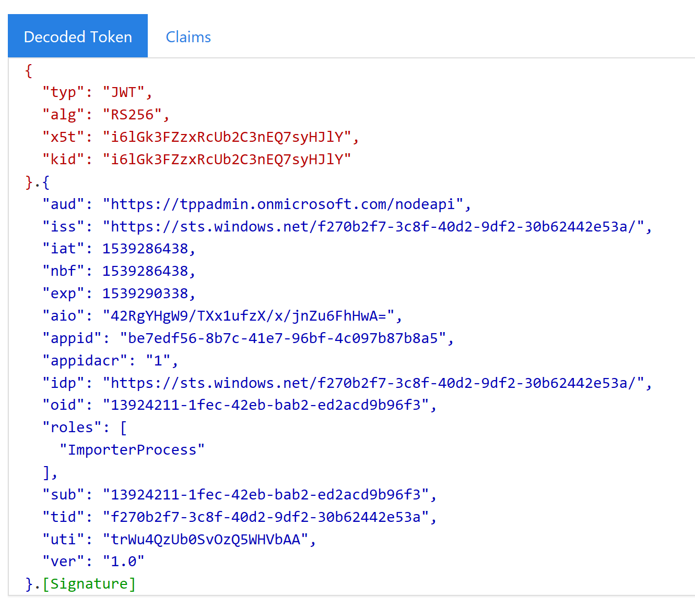

Prerequisites
=============

Before starting, ensure you have the following permissions:

-   Azure AD Global Admin in Azure environment or
 If you are performing these steps as the external Azure AD guest, the
 Azure AD must have the App Registrations by users option enabled.

-   PostMan client app -- it will be required to test and validate your
    app registration was successful. You can download and install
    PostMan application for the platform of your choice from this
    location: <https://www.getpostman.com/apps>

The Objectives
==============

> The main objective of the steps below is to create and collect the
> required information that will be used by the Data API authentication
> flow. The table below is your checklist where you will be filling the
> information collected in various steps of the process.

| Application    | Property Setting     | Value |
|----------------|----------------------|-------|
| Data API       | Name                 |       |
|                | Application Type     |       |
|                | Sign-on URL          |       |
|                | Application ID       |       |
|                | App Id URI           |       |
|                | Manifest             |       |
| API Client App | Name                 |       |
|                | Application Type     |       |
|                | Sign-on URL          |       |
|                | Application ID       |       |
|                | Required Permissions |       |
|                | API Access Key       |       |
|                | Manifest             |
  

Steps
=====

Register Data API in AD
-----------------------

1.  Log into the Azure portal using your Azure credentials

2.  Make sure you are in the correct AD tenant environment (e.g.
    contoso.onmicrosoft.com)

3.  Navigate to Azure Active Directory resource on the nav toolbar

4.  Under 'App Registrations', click 'New application registration' and
    complete as follows:

    a.  **Name**: Data API (or any other name of your choice)

    b.  **Application Type**: Web app/API

    c.  **Sign-on URL**:
        [https://customwebapi.azurewebsites.net](https://customwebapi.azurewebsites.net)
        (it can be any valid URI)

5.  Click 'Create' button.

6.  Upon creation copy the Display name, Application ID and the Home
    page values into the table above.

7.  Click 'Settings'

8.  Click on 'Properties'

9.  Change the value of the App ID URI to the unique URI that Data API
    will use as the audience identifier when presenting itself to the
    client apps. It can be changed later.
    [https://contoso.onmicrosoft.com/webapi](https://contoso.onmicrosoft.com/datapi)

10. Click 'Save'

11. Go onto the previous blade and click 'Manifest' pen icon on the menu
    bar. It will open a new blade with the 'Edit manifest' title. The
    manifest JSON configuration settings will be displayed.

12. Find the line 21 containing the value for 'oauth2AllowImplicitFlow'.
    Change its value from 'false' to 'true' (without quotations).

13. Find in the 3^rd^ line the entry for 'appRoles'. It will have the
    empty '\[\]' brackets. Replace the entire line with the following
    lines:

> \"appRoles\": \[
>
> {
>
> \"allowedMemberTypes\": \[
>
> \"Application\"
>
> \],
>
> \"description\": \"Allows applications to access this api\",
>
> \"displayName\": \"Access this api as an importer process\",
>
> \"id\": \"6222887c-2a18-4b96-9a8d-548f88faf77c\",
>
> \"isEnabled\": true,
>
> \"value\": \"ImporterProcess\"
>
> }
>
> \],

14. Click 'Save'. If you received an error, make sure you've copied the
    lines in the Step 12 all correctly and the manifest is in a properly
    formed JSON format. Then, try again to save it.

Register Client APP in AD
-------------------------

1.  Under 'App Registrations', click 'New application registration' and
    complete as follows:

    a.  **Name**: Data API Client App (or any other name of your choice)

    b.  **Application Type**: Web app/API

    c.  **Sign-on URL**:
        [https://customclientapp](https://jberclientapp) (it can be any
        valid URI)

2.  Click 'Create' button.

3.  Upon creation copy the Display name, Application ID and the Home
    page values into the table above.

4.  Click 'Manifest' pen icon on the menu bar. It will open a new blade
    with the 'Edit manifest' title. The manifest JSON configuration
    settings will be displayed.

5.  Find the line 21 containing the value for 'oauth2AllowImplicitFlow'.
    Change its value from 'false' to 'true' (without quotations).

6.  Click 'Save'

7.  Go back to the previous blade and click 'Settings'

8.  Click on 'Required Permissions'

9.  Click '+Add'

10. Click 'Select an API'

11. In the 'Search for other applications with Service Principal name'
    input box enter the first letters of the API registration you've
    created in the previous section, e.g. 'Data API'

12. Find the API registration you created earlier and select it from the
    list.

13. Click 'Select' button.

14. Select both check boxes on: one is for Application Permissions and
    the other is for Delegated Permissions.

15. Click 'Select' button.

16. Click 'Done' button after confirming that you have two steps with 1
    role and 1 scope selected for the API permissions.

17. Click '+Add' again to add permissions for accessing Azure KeyVault

18. Click 'Select an API'

19. In the 'Search for other applications with Service Principal name'
    input box enter 'Azure Key Vault'

20. Click 'Select' button.

21. Select the check box for the Delegated Permissions.

22. Click 'Select' button.

23. Click 'Done' button.

24. Click on 'Keys' from API Access section under 'Settings'

25. Enter the Key description (e.g. 'AccessDataAPI')

26. Select the desired expiration period: either in 1, 2 years or never
    expires.

27. Click 'Save'

28. Do not close the screen until you copy the value of the newly
    generated secret. Paste the secret value into your table.

29. At this point you have all app registrations configured and are
    ready to go the next step.

Obtain the User Consent from Azure AD
-------------------------------------

1.  Open a Internet browser of your choice in the in-private mode.
    Chrome is recommended.

2.  Enter the URL into the browser's address line that is constructed in
    the following format:

[**https://login.microsoftonline.com/\<tenant\>.onmicrosoft.com/oauth2/authorize**](https://login.microsoftonline.com/%3ctenant%3e.onmicrosoft.com/oauth2/authorize)

**?client\_id=\<Application ID\>&resource=\<App Id
URI\>&redirect\_uri=\<Sign-on
URL\>&response\_type=code&prompt=admin\_consent**

> replacing the template values with the settings you've collected in
> the previous steps.

3.  Enter your URL into the browser's address line and run it.

4.  You will be redirected to your organization's login screen where you
    would need to provide your login credentials of the user with the
    Global Admin permissions to your Azure AD.

5.  Once logged in, you will be prompted to consent on giving the
    permissions to your Azure Data API Client App to access the Azure
    Data API. **Note:** It will also show the 'Sign in and read user
    profile', but you can safely ignore this was never requested and
    won't be executed on your behalf. It is rather a UI misconception
    than the real permission request.

6.  Click 'Accept' button.

7.  After a while, you will be redirected to non-existent page with the
    address line showing something similar to this line:

    [https://customclientapp/?code=AQABAAIAAAC5una0EUFg\...]{.underline}

8.  You're done!

Test Registration in PostMan
----------------------------

1.  Launch the PostMan desktop application

2.  You don't have to sign up or sign in to test this registration.

3.  Once in the Builder workspace, enter the following URL into the
    address line:

> [https://login.microsoftonline.com/\<tenant\>.onmicrosoft.com/oauth2/token]{.underline}

4.  Make sure you're constructing the POST URL call.

5.  Click on the 'Headers' tab.

6.  Enter the 'Content-Type' for the Header's key.

7.  Enter the 'application/x-www-form-urlencoded' for the Header's
    value.

8.  Click on 'Body' tab.

9.  Enter the following values into the body's key/value settings:

| Key           | Value                                        |
|---------------|----------------------------------------------|
| client_id     | 7481b2a1-7dfc-477a-a21b-e1c854114863         |
| client_secret | MyMWOGH8l4tUeR9NTPCilamf3/k9SZxIk5/B+dPQWUM= |
| resource      | https://contoso.onmicrosoft.com/webapi       |
| grant_type    | client_credentials                           |  

10. Click 'Send' button.

11. Upon successful authentication you should receive in the Body of the
    response message the JWT token 'access\_token' among the other
    properties. It will be similar to this screenshot:

12. This access token will then be used to authenticate the client
    application against Azure Azure Active Directory and get permissions
    to access the Data API. In order to verify that this token indeed is
    the one would grant you access to the Data API, you can optionally
    copy the content of your access\_token content and then decode it
    using the following JWT decoding online service: <http://jwt.ms/>

13. Copy the entire content of the access\_token from PostMan.

14. Launch your Internet browser and navigate to: <http://jwt.ms/>

15. Paste the token's content into the first top window.

16. If the token is valid, it will be decoded in the bottom window where
    you could check all its values, including the 'roles' values that
    should state: "ImporterProcess". That means this token allows access
    only and only to the process with ImporterProcess, which, in our
    case, is our Data API service.

Congratulations! You've completed all steps required to register Data
API and the client application in your Azure Active Directory.
